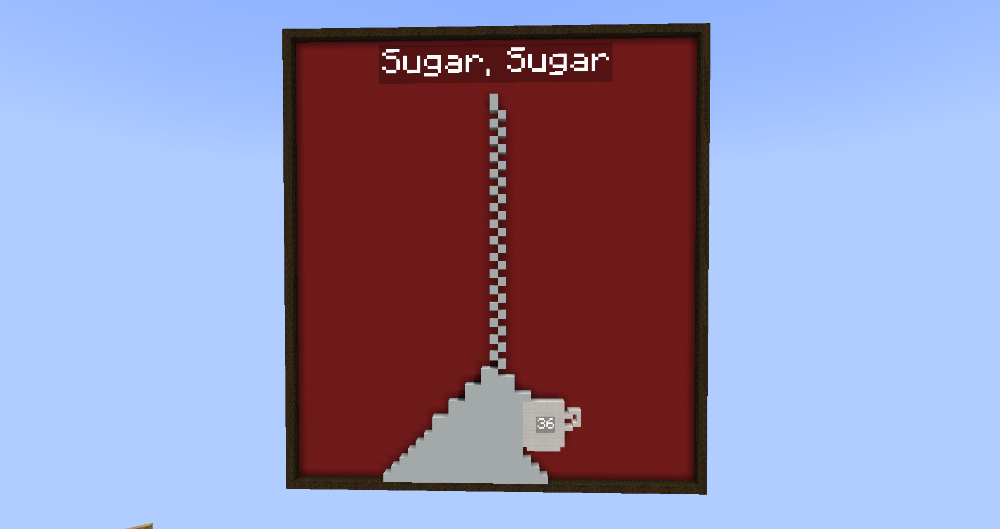
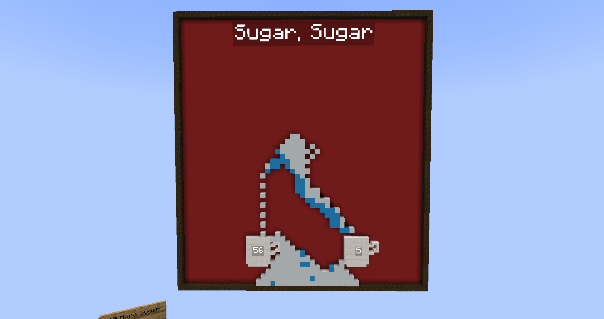

## Minecraft Memory Matching Minigame

This is a recreation of the old Flash game, [Sugar Sugar](https://www.coolmathgames.com/0-sugar-sugar), by bartbonte.

It runs on mcfunction files generated using [a python script](datapacks/sugar/data/sugar/functions/sugar/gen_sugar_files.py) which makes use of my [PythonToMcfunctionTranspiler](https://github.com/Goldenlion5648/PythonToMcfunctionTranspiler/blob/master/python_helpers/helper_functions.py)

The "sugar" is marker entities with white_concrete in their head slot.

The player can draw lines from a distance to redirect the sugar. The goal is to get 100 sugar in each cup.

The player can even reverse gravity to make sugar "fall" upward.